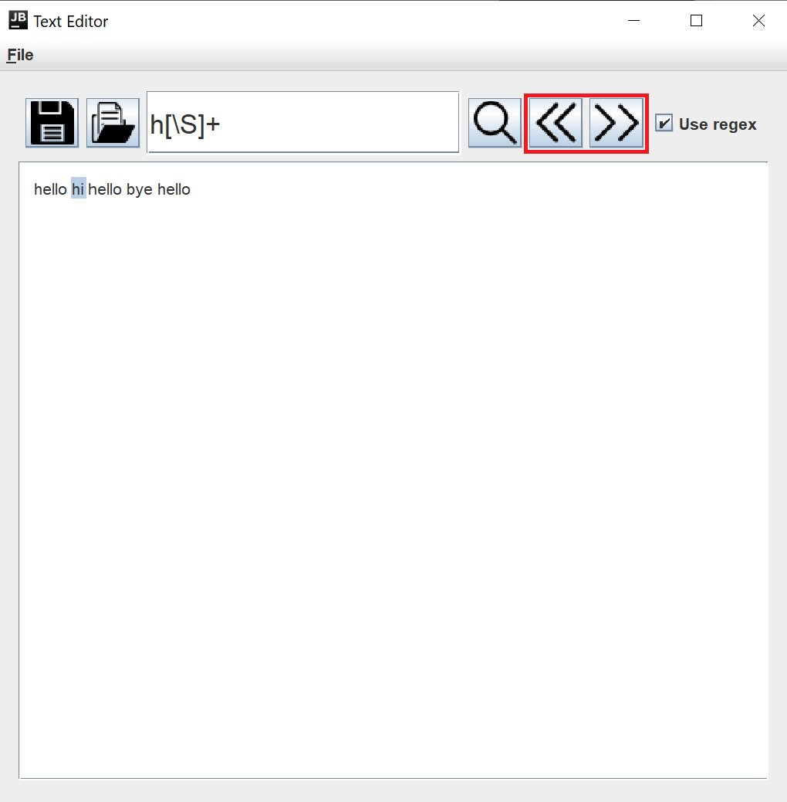

# Simple-Text-Editor

Simple Text Editor - text editor with basic functions:
<ul>
  <li> opening text file using GUI </li>
  <li> closing text file using GUI </li>
  <li> searching through file using basic strings </li>
  <li> searching through file using regular expressions </li>
</ul>

Application was build using Java + Swing for GUI.

## Basic functionality
Opening and saving text files is possible by clicking top left button. In a pop up you can easily select any file.
<br>


<br><br>

Searching through a file is possible in two ways, using plain text or regular expressions. By clicking on magnifying glass icon first occurrance of matching pattern is highlighted. 
<br>


<br><br>

By using arrows next or previous matches of the pattern can be found.
<br>


## How to run?
Using maven: <br>
```mvn package ``` <br>
```java -cp .\target\Simple-text-editor-1.0.jar editor.Applicationrunner ```
